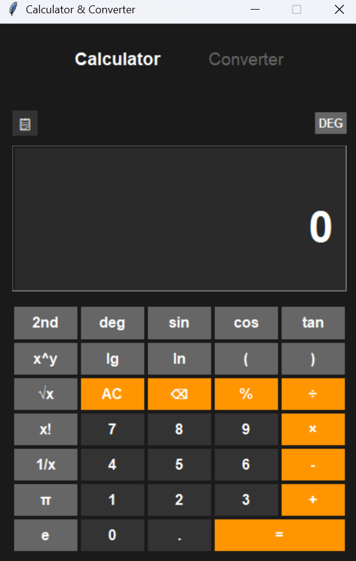
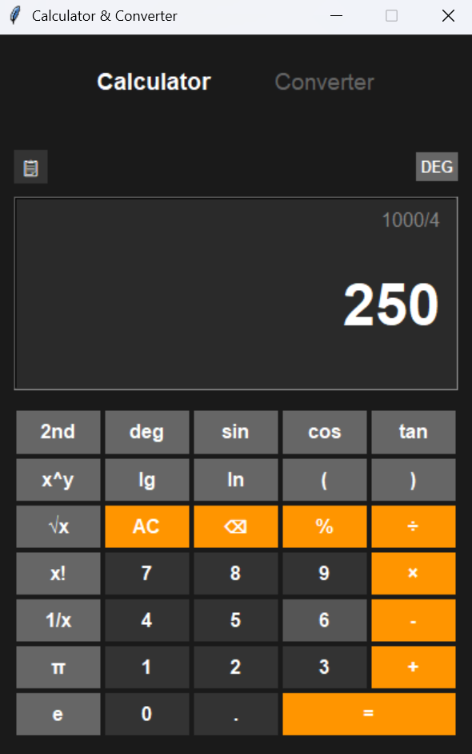
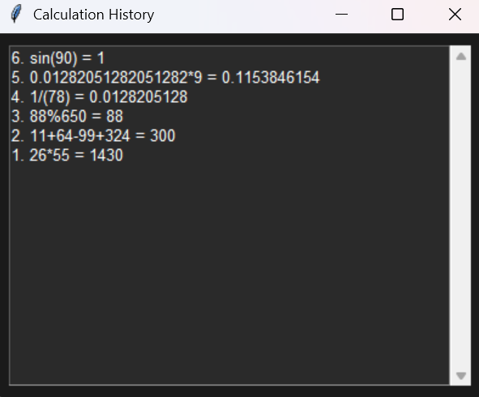
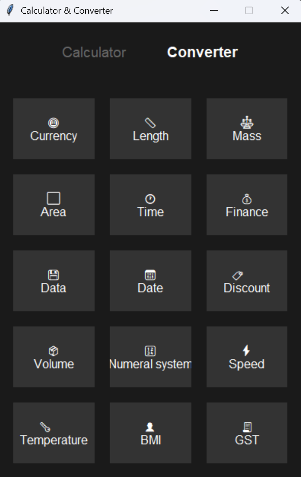

# CalcMaster: Your All-in-One Desktop Calculator & Converter  

Welcome to **CalcMaster**, a powerful and intuitive desktop application designed to streamline your daily calculations and conversions.  
Built with **Python** and **Tkinter**, CalcMaster offers a modern dark-themed interface, whether you’re a student, professional, or anyone in need of precise numerical tools.  

Say goodbye to juggling multiple apps – CalcMaster brings a full-featured **scientific calculator** and a versatile **unit converter** into one seamless experience.  

---

## ✨ Features  

### 🚀 Scientific Calculator: Precision at Your Fingertips  
- **Comprehensive Operations:** Perform arithmetic, trigonometry, logarithms, powers, roots, factorials, and constants (π, e).  
- **Flexible Angle Modes:** Switch between Degree and Radian modes.  
- **2nd Functions:** Access inverse trigonometric and advanced functions with a dedicated toggle.  
- **Calculation History:** Review your past equations in a history panel.  
- **Keyboard Support:** Input directly from your keyboard for faster workflow.  
- **Error Handling:** User-friendly messages for invalid operations.  

### 🔄 Smart Converter: Transform Units with Ease  
- **Extensive Unit Conversions:** Length, Mass, Area, Volume, Speed, Data, Temperature, etc.  
- **Specialized Calculators:**  
  - 📊 **BMI Calculator**  
  - 💰 **GST & Discount Calculators**  
  - 🏦 **Finance & Date Tools**  
- **Currency Converter:** Quick static-rate conversions (API integration planned).  
- **Numeral Systems:** Convert between Binary, Decimal, Hexadecimal, and Octal.  

---

## 📸 Demo  

Here’s CalcMaster in action:  

### 🧮 Default Calculator Interface  
A modern dark-themed calculator with scientific functions.  
<br>  
  

---

### ➕ Performing Calculations  
See results update in real-time while you compute.  
<br>  
  

---

### 📜 Calculation History  
Go back and review all your previous calculations easily.  
<br>  
  

---

### 🔄 Converters Hub  
Choose from multiple built-in converters for everyday needs.  
<br>  
  

---

## 📦 Installation  

1. Clone the repository:  
   ```
   git clone https://github.com/VipranshOjha/UIUX-Projects.git
   cd UIUX-Projects/CalcMaster
   ```

2. Requirements:

   * Python 3.x
   * Tkinter (pre-installed in most Python distributions)

3. Run the application:

   ```
   python main.py
   ```

---

## 📂 File Structure

```
CalcMaster/
├── main.py          # Entry point of the application
├── Calculator.py    # Logic & UI for the scientific calculator
├── Converter.py     # Logic & UI for unit conversions
└── screenshots/     # App screenshots
```

---

## ❤️ Contributing

We welcome contributions to make CalcMaster even better!

* Report bugs via GitHub Issues.
* Suggest features via Issues.
* Fork & submit PRs for fixes or improvements.

---

⭐ **Star this repo** if you find CalcMaster useful!
