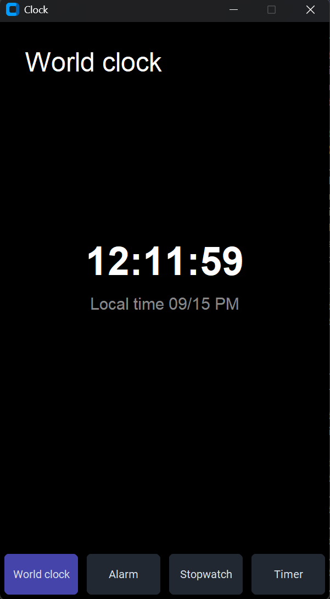
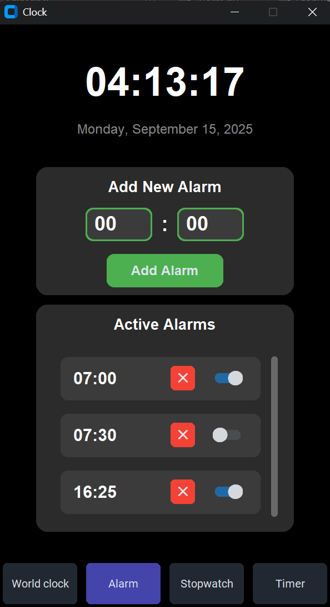
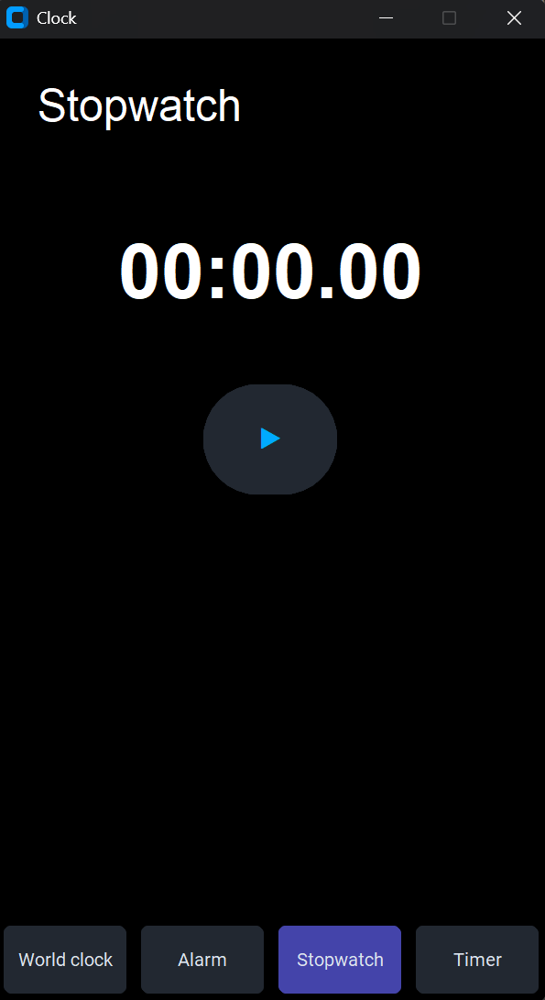
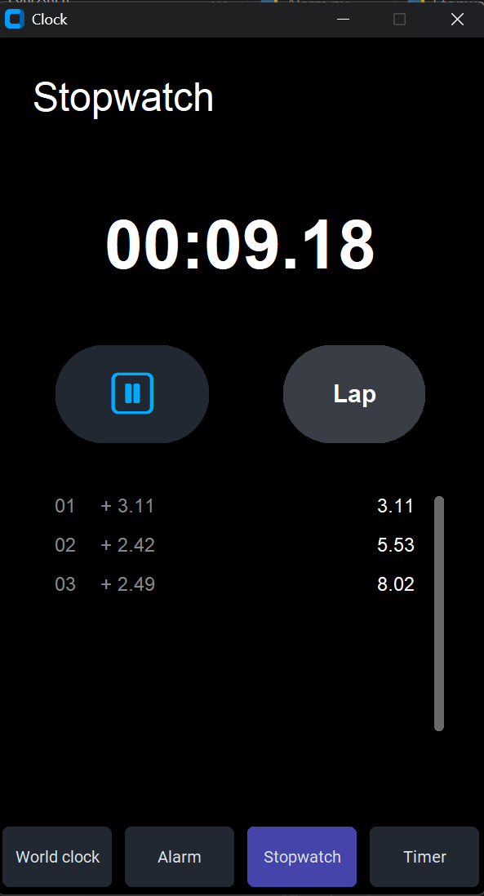
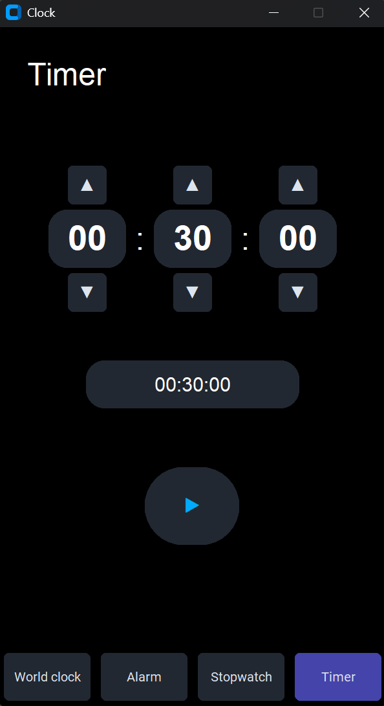
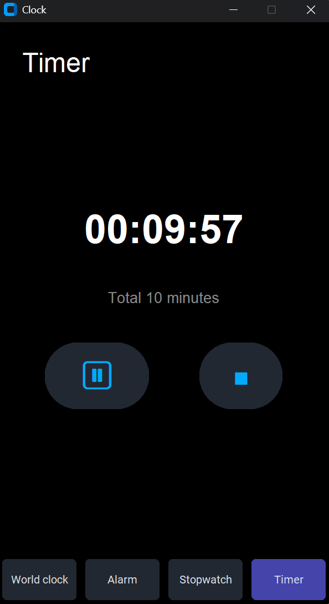

# ⏰ TimeMaster  

**TimeMaster** is a sleek and intuitive time management application built with **Python’s Tkinter library**.  
It brings together a **World Clock, Alarm, Stopwatch, and Timer** into one user-friendly interface, designed for productivity and ease of use.  

---

## ✨ Features  

- **🌍 World Clock** – View the current local time at a glance.  
- **⏰ Alarm** – Set and manage multiple alarms with ease.  
- **⏱️ Stopwatch** – Track elapsed time with lap functionality.  
- **⏳ Timer** – Set countdowns for tasks, study sessions, or breaks.  

---

## 📸 Screenshots  

Take a look at TimeMaster in action:  

### 🌍 World Clock  
Displays the current local time.  
<br>  
  

---

### ⏰ Alarm  
Create new alarms and manage your active alarms.  
<br>  
  

---

### ⏱️ Stopwatch  
Track time with precision, including lap recording.  

| Stopwatch Default | Stopwatch with Laps |  
| :---: | :---: |  
|  |  |  

---

### ⏳ Timer  
Set a countdown and track progress visually.  

| Timer Setup | Timer Running |  
| :---: | :---: |  
|  |  |  

---

## 🚀 Installation  

1. **Clone the repository**  
   ```
   git clone https://github.com/VipranshOjha/UIUX-Projects.git
   cd UIUX-Projects/TimeMaster
   ```

2. **Install dependencies**

   ```
   pip install -r requirements.txt
   ```

3. **Run the application**

   ```
   python main.py
   ```

---

## 📂 Project Structure

```
TimeMaster/
├── main.py
├── Alarm.py
├── Timer.py
├── Stopwatch.py
├── WorldClock.py
├── screenshots/
│   ├── world-clock.png
│   ├── alarm.png
│   ├── timer-setup.png
│   ├── timer-running.png
│   ├── stopwatch-default.png
│   └── stopwatch-laps.png
└── requirements.txt
```

---

## 🤝 Contributing

Contributions are always welcome!

* Fork the repo
* Create a feature branch
* Submit a pull request
