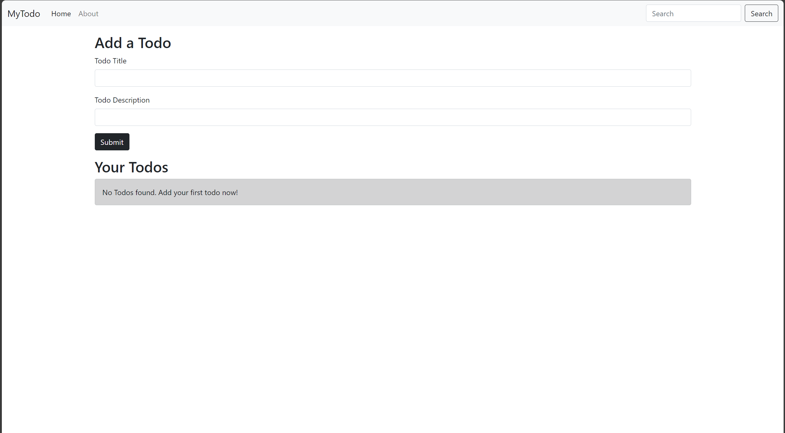
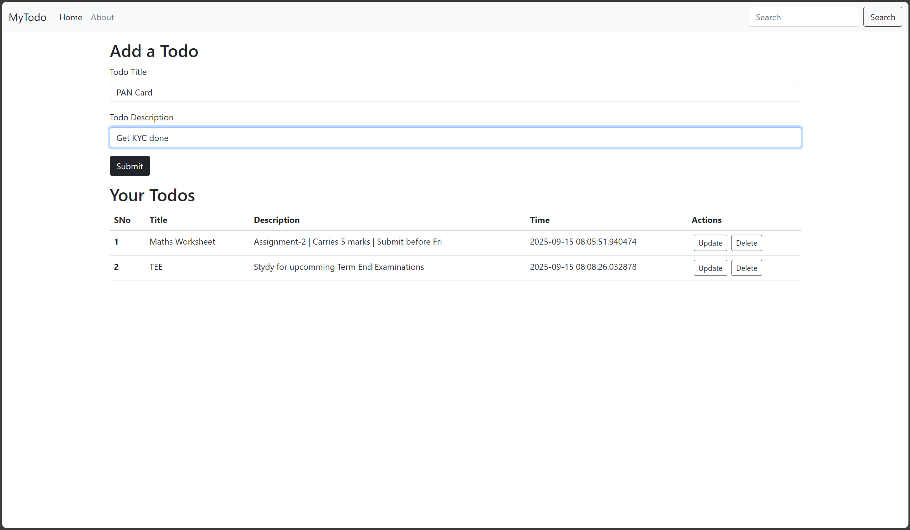
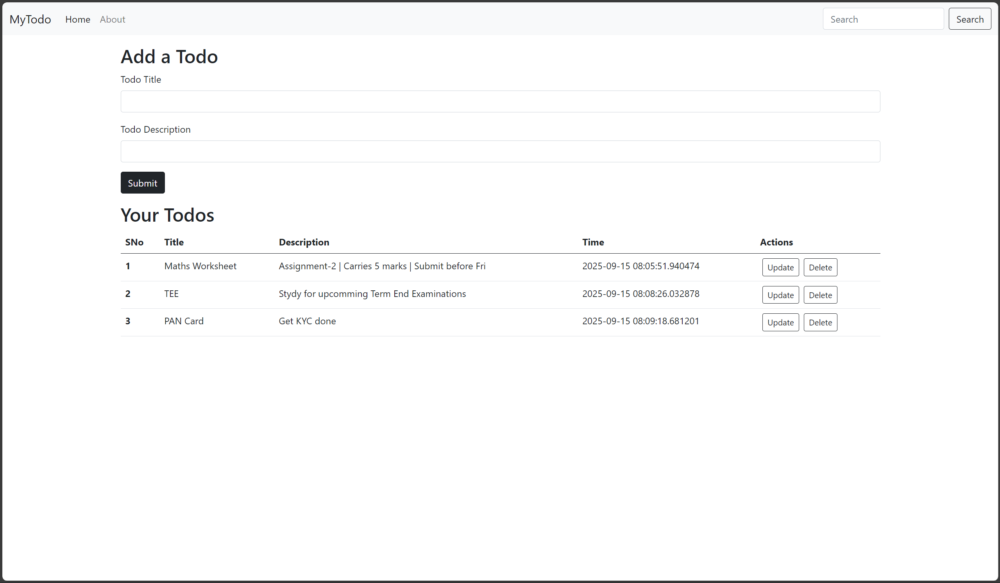
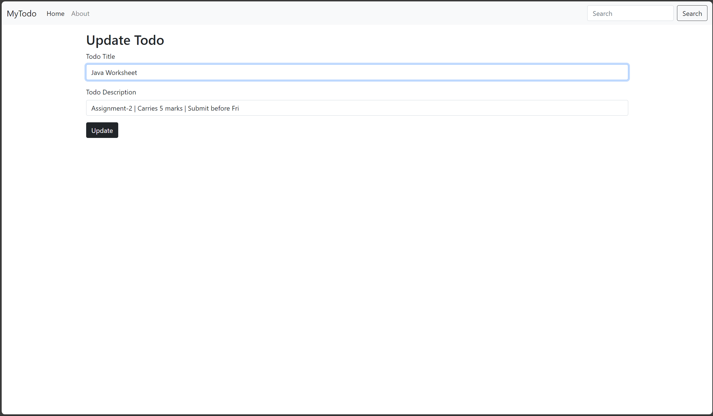
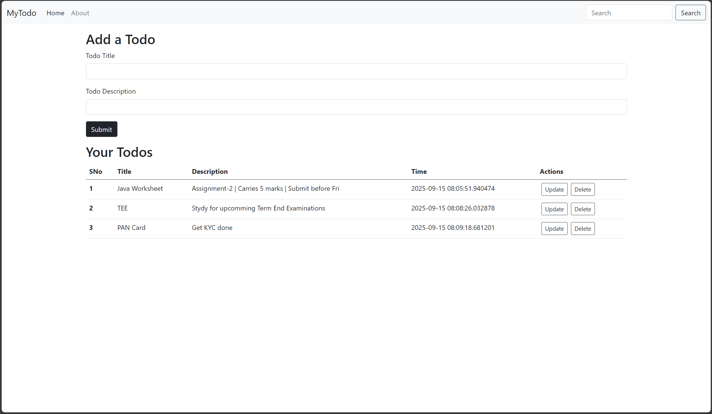

# 📝 To-Do List Web App

A **clean and intuitive To-Do List application** built as part of my UI/UX projects.  
It helps users **organize tasks, track progress, and boost daily productivity** with a simple yet functional interface.

---

## 🚀 Features

- ➕ **Add Tasks** – Create todos with a title and description  
- ✏️ **Update Tasks** – Edit existing tasks inline  
- ❌ **Delete Tasks** – Remove completed or unwanted todos  
- 📋 **Minimal UI** – Focused, distraction-free interface  
- ⚡ **Responsive Design** – Works smoothly across devices  
- ⏰ **Timestamps** – Track when each task was added  

---

## 📸 Screenshots

### 🟢 Default View
When no tasks are present.  


### 🟡 Adding a Todo
Entering title and description.  


### 🔵 After Adding Todos
Todos appear in a structured table with actions.  


### 🟠 Updating a Todo
Editing an existing task.  


### 🔴 After Update
Updated task instantly reflected.  


---

## 🛠️ Tech Stack

- **Frontend:** HTML, CSS (Bootstrap), JavaScript  
- **Backend:** Flask (Python)  
- **Database:** SQLite  

---

## ⚡ Setup & Run

1. Clone the repository:
   ```
   git clone https://github.com/VipranshOjha/UIUX-Projects.git
   cd UIUX-Projects/To-Do-List
   ```

2. (Optional) Create a virtual environment:

   ```
   python -m venv venv
   source venv/bin/activate   # Mac/Linux
   venv\Scripts\activate      # Windows
   ```

3. Install dependencies:

   ```
   pip install -r requirements.txt
   ```

4. Run the app:

   ```
   python app.py
   ```

5. Open in browser:

   ```
   http://127.0.0.1:5000/
   ```

---

## 🎯 Future Improvements

* 📅 Task due dates & reminders
* 🏷️ Categories/labels for better organization
* 🖱️ Drag-and-drop task reordering
* 🌙 Dark/light mode toggle

---
